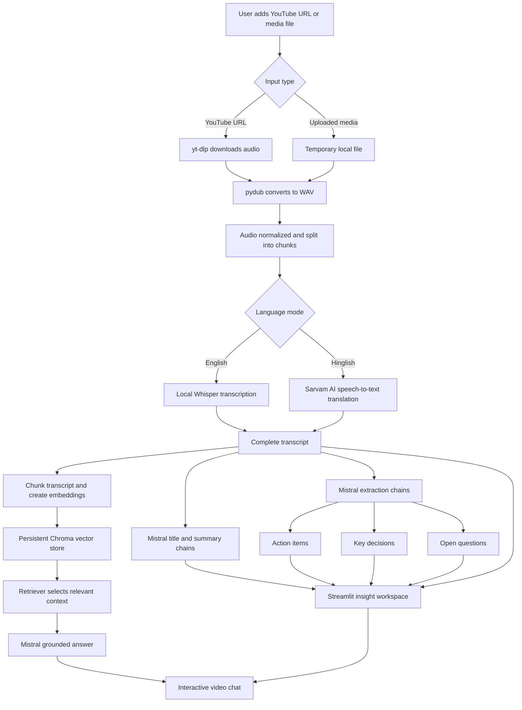

# Chalchitra

### Video intelligence for people who need the point, not another replay

Chalchitra is an AI-powered video summarizer that turns long-form meetings, lectures, interviews, and YouTube videos into a structured, searchable brief. It combines local speech recognition with specialized language-model workflows to surface the information people actually need: a concise summary, action items, key decisions, unresolved questions, and a chat interface grounded in the source transcript.

The project is built as a Streamlit application so the full workflow is accessible from a browser with no separate frontend service.

## Why this project matters

Long videos create an information-retrieval problem, not just a transcription problem. Chalchitra addresses that problem in stages:

- Converts YouTube links and uploaded media into normalized audio.
- Supports English transcription with local Whisper inference.
- Supports Hinglish transcription and English translation through Sarvam AI.
- Uses Mistral-powered chains to produce meeting-ready outputs.
- Builds a local Chroma vector store for transcript-grounded question answering.
- Presents the results in a focused UI designed for quick scanning and follow-up.

## Product capabilities

| Capability | What it does |
| --- | --- |
| Multi-source input | Accepts YouTube URLs and uploaded audio/video files. |
| Hybrid transcription | Uses Whisper for English and Sarvam AI for Hinglish translation. |
| Structured extraction | Generates a title, summary, action items, decisions, and open questions. |
| Retrieval-augmented chat | Answers questions using relevant transcript chunks instead of relying on unsupported memory. |
| Downloadable output | Lets users download the full transcript as a text file. |
| Interactive experience | Provides progress states, tabs, chat history, responsive layout, and animated visual feedback in Streamlit. |

## Application flow



## Architecture

```text
chalchitra/
├── app.py                    # Streamlit UI and application orchestration
├── core/
│   ├── extractor.py          # Action items, decisions, and questions
│   ├── rag_engine.py         # Retrieval-augmented generation workflow
│   ├── summarizer.py         # Title and hierarchical summary generation
│   ├── transcriber.py        # Whisper and Sarvam transcription routing
│   └── vector_store.py       # Chroma persistence and retriever setup
├── utils/
│   └── audio_processor.py    # Downloading, conversion, and audio chunking
├── downloads/                # Downloaded/generated media workspace
├── .env.example              # Required environment variable names
├── requirements.txt          # Python dependencies
└── README.md
```

### Responsibility boundaries

- **Interface layer:** `app.py` owns user input, progress feedback, session state, insight tabs, and chat rendering.
- **Media layer:** `utils/audio_processor.py` handles URL downloads, file conversion, and chunk creation.
- **Speech layer:** `core/transcriber.py` selects Whisper or Sarvam based on the selected language mode.
- **Insight layer:** `core/summarizer.py` and `core/extractor.py` turn the transcript into structured outputs.
- **Knowledge layer:** `core/vector_store.py` embeds transcript chunks, while `core/rag_engine.py` retrieves context and generates grounded answers.

## Technology stack

- **Python 3.10+** and **Streamlit** for the application runtime and UI.
- **OpenAI Whisper** and **PyTorch** for local English speech recognition.
- **Sarvam AI** for Hinglish speech-to-text translation.
- **Mistral AI** through LangChain for summaries, metadata extraction, and chat.
- **Chroma** with **Hugging Face `all-MiniLM-L6-v2` embeddings** for local semantic retrieval.
- **pydub**, **FFmpeg**, and **yt-dlp** for media acquisition and audio processing.

## Getting started

### 1. Prerequisites

- Python 3.10 or newer.
- FFmpeg installed and available on your system `PATH`.
- A Mistral API key.
- A Sarvam API key if Hinglish mode is required.

On Windows, verify FFmpeg is available with:

```powershell
ffmpeg -version
```

### 2. Create and activate a virtual environment

```powershell
python -m venv .venv
\.venv\Scripts\Activate.ps1
```

On macOS/Linux:

```bash
python3 -m venv .venv
source .venv/bin/activate
```

### 3. Install dependencies

```bash
python -m pip install --upgrade pip
pip install -r requirements.txt
```

### 4. Configure environment variables

Create a `.env` file in the project root. Start from `.env.example`:

```env
MISTRAL_API_KEY=your_mistral_api_key
SARVAM_API_KEY=your_sarvam_api_key
WHISPER_MODEL=small
```

`SARVAM_API_KEY` is only needed for Hinglish mode. The Whisper model can be changed to another installed/downloadable model such as `base`, `medium`, or `large`, depending on the available hardware.

### 5. Launch the application

```bash
streamlit run app.py
```

Streamlit will print a local URL, usually `http://localhost:8501`.

## Using the application

1. Upload an audio/video file or paste a YouTube URL.
2. Select `English` or `Hinglish` in the sidebar.
3. Select **Analyze video** and wait for the transcription and insight pipeline to complete.
4. Review the overview, action items, decisions, open questions, and transcript tabs.
5. Use **Ask your video** to query the transcript in natural language.
6. Download the transcript when a plain-text copy is useful for sharing or archival.

Supported upload formats include `mp4`, `mov`, `mkv`, `avi`, `mp3`, `wav`, and `m4a`.

## Engineering highlights

### Hybrid inference strategy

English transcription runs locally through Whisper, which reduces dependency on a speech API for that path. Hinglish mode uses Sarvam AI's translation-capable endpoint because the product goal is an English-readable result from mixed Hindi-English speech.

### Grounded question answering

The chat workflow splits the transcript into overlapping chunks, embeds them locally, retrieves the most relevant chunks for each question, and supplies only that context to the Mistral response chain. This makes the assistant useful for follow-up questions while reducing unsupported answers.

### Streamlit-first user experience

The UI keeps the main workflow in one place: source selection, analysis progress, structured outputs, transcript export, and chat. Session state preserves the generated brief and conversation across Streamlit reruns.

## Generated and local data

The application may create local working data while processing media:

- `downloads/` stores downloaded or converted media.
- `vector_db/` stores the Chroma collection used by retrieval.
- Temporary uploaded files are removed after processing completes.

Do not commit `.env`, API keys, downloaded media, model caches, or generated vector data to source control.

## Current considerations

- First runs can take longer because Whisper, embedding models, and PyTorch dependencies may need to initialize or download model files.
- Processing time depends on video duration and the selected Whisper model.
- FFmpeg must be installed separately; the Python package alone does not provide the FFmpeg executable.
- Mistral is required for summaries, extracted insights, and transcript chat.
- The current chat experience is scoped to the active transcript and is not designed as a multi-user persistence layer.

## Potential next steps

- Add automated unit and integration tests around media processing, extraction contracts, and RAG retrieval.
- Add timestamp-aware transcript citations to chat answers.
- Add PDF and Markdown export alongside the existing text download.
- Move long-running processing to a background job for production-scale workloads.
- Add authentication and per-user vector-store isolation for multi-user deployment.

## License

No license has been declared yet. Add a license before distributing the project publicly.